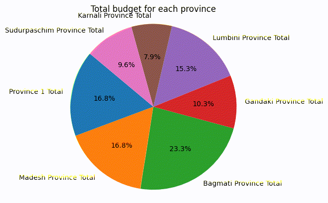

# Budget and Expenditure Analysis — Province-level (FY 2021-22)

This repository provides tools for analyzing budget and expenditure data for local bodies at the provincial level, based on the fiscal year 2021-22.

## Overview

The project analyzes budget vs. expenditure data for local bodies across different provinces, generating insights such as:

* **Composition Charts**: Visualizations comparing the budget and expenditure for each local body.
* **Utilization Comparisons**: Analysis of budget utilization across different local bodies and provinces.
* **Local-body Summaries**: Detailed pie charts and summary statistics for each province.

---
- [Find Charts](https://github.com/KhagendraN/DataAnalysis/tree/main/charts)  

## Data

* **Primary Dataset**: [Find here](https://github.com/KhagendraN/DataAnalysis/tree/main/data)

## Project Structure

The project is organized into the following directories:

* [**`feature_engineering/`**](https://github.com/KhagendraN/DataAnalysis/tree/main/feature_engineering): Contains scripts for reading, cleaning, and feature extraction from the raw data.
* [**`visualization/`**](https://github.com/KhagendraN/DataAnalysis/tree/main/visualization): Includes helper functions for plotting various charts, such as composition bars, pie charts, and utilization plots.
* [**`notebooks/`**](https://github.com/KhagendraN/DataAnalysis/tree/main/notebooks): Contains Jupyter notebooks for province-level analysis [`koshi_province.ipynb`](https://github.com/KhagendraN/DataAnalysis/blob/main/notebooks/koshi_province.ipynb) and an overall observation notebook ([`overall_observation.ipynb`](https://github.com/KhagendraN/DataAnalysis/blob/main/notebooks/overall_obs.ipynb)).

## Getting Started

To begin analyzing the data, follow these steps:

### 1. Set up your Python Environment

Create and activate a Python environment (Python 3.10+ is recommended).

### 2. Install Dependencies

Install the required dependencies by running:

```bash
pip install -r requirements.txt
```

### 3. Run the Notebooks

Open the relevant Jupyter notebook (e.g., [`notebooks/province1.ipynb`](https://github.com/KhagendraN/DataAnalysis/blob/main/notebooks/koshi_province.ipynb)) and execute the cells sequentially from top to bottom.

## Notes

* The notebooks include inline observations next to the visualizations, summarizing key insights from the data.

## Contributing

* Contributions are welcome! Feel free to edit the notebooks, add observations, and submit a pull request to the `main` branch.

---

## Charts



---

Enjoy exploring the data and uncovering insights!


